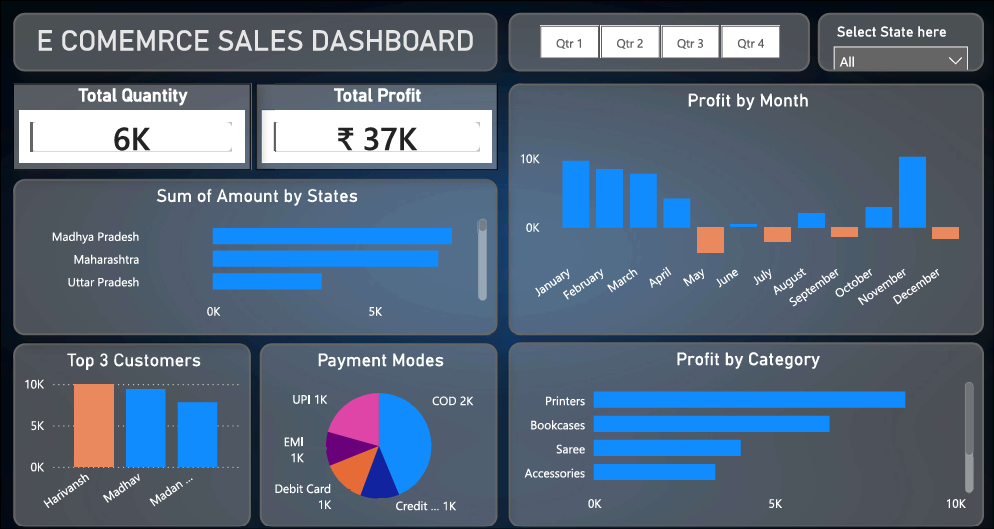
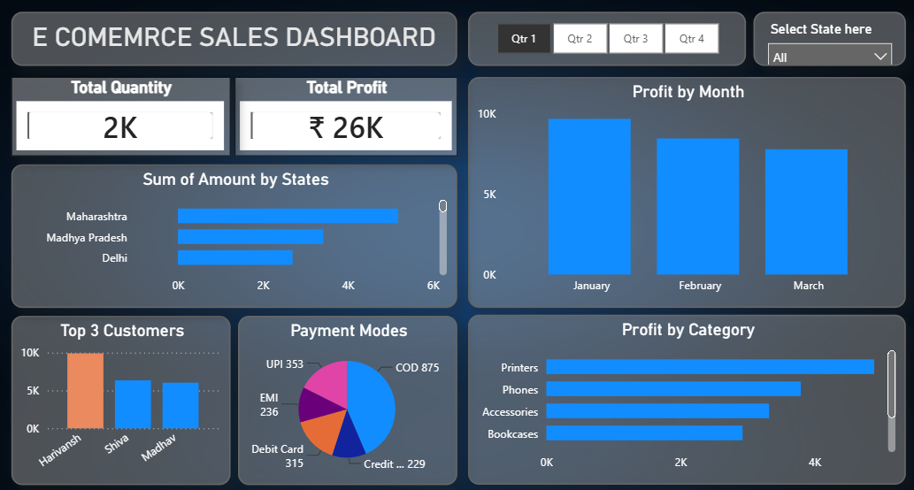
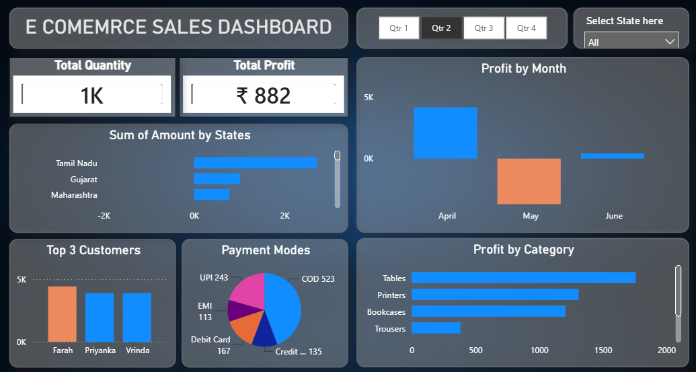
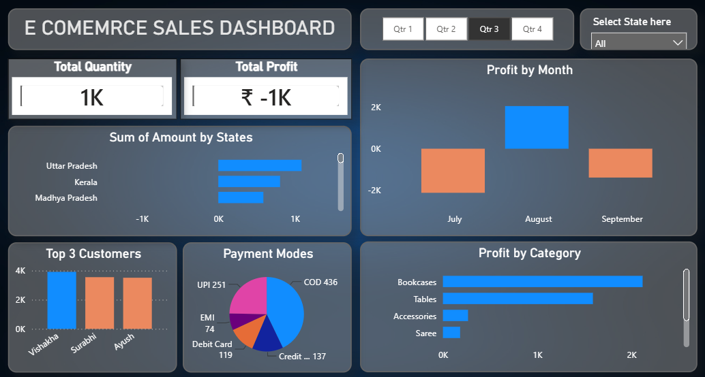
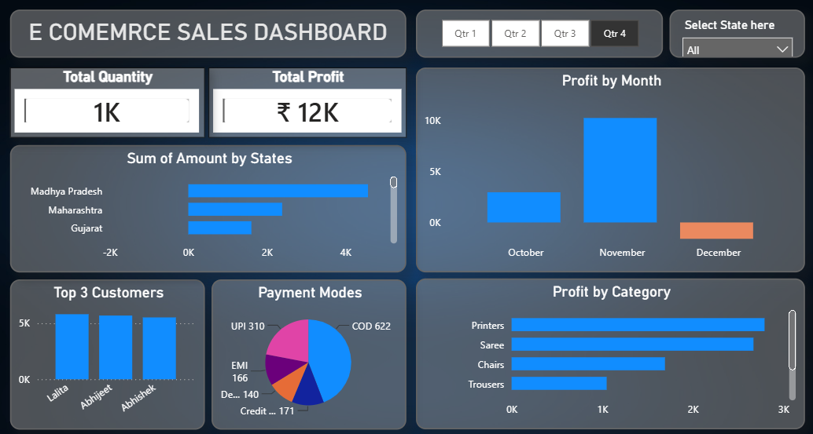

# 📊 E-Commerce Sales Dashboard | Power BI


An interactive Power BI dashboard for analyzing e-commerce sales performance, profitability, customer behavior, payment preferences, and category-wise insights.

## 📌 Project Overview

This project presents an interactive **E-Commerce Sales Dashboard** developed using **Microsoft Power BI**. The dashboard transforms raw transactional data into actionable business insights, enabling users to monitor sales performance, profitability, customer behavior, payment preferences, and category-level performance.

Using Power Query, DAX, and data modeling techniques, the dashboard provides an intuitive and data-driven approach to understanding business performance across multiple dimensions.

---

## 🚀 Key Features

### 📈 Sales Performance Analysis
- Total Quantity Sold
- State-wise Sales Analysis
- Quarter-wise Performance Tracking
- Interactive Filtering

### 💰 Profit Analysis
- Total Profit Monitoring
- Monthly Profit Trends
- Quarter-wise Profit Analysis
- Profitability Insights

### 👥 Customer Insights
- Top 3 Customers by Sales
- Customer Contribution Analysis

### 🛍️ Product Performance
- Category-wise Profit Analysis
- Best Performing Product Categories

### 💳 Payment Mode Analysis
- Cash on Delivery (COD)
- UPI Transactions
- Debit Card Payments
- Credit Card Payments
- EMI Transactions

### 🎯 Interactive Dashboard Features
- Quarter Slicer (Q1, Q2, Q3, Q4)
- State Filter
- Dynamic Cross Filtering
- Interactive Visualizations

---

## 🛠️ Tools & Technologies Used

| Technology | Purpose |
|------------|----------|
| Power BI | Dashboard Development |
| Power Query | Data Cleaning & Transformation |
| DAX | Measures & KPIs |
| CSV Files | Data Source |
| Data Modeling | Relationship Management |
| Data Visualization | Business Insights |

---

## 📂 Repository Structure

```text
Ecommerce-Sales-Dashboard
│
├── README.md
│
├── Background
│   └── background.jpg
│
├── Dashboard
│   ├── Ecommerce.pbix
│   └── Ecommerce.pdf
│
├── Datasets
│   ├── Orders.csv
│   └── Details.csv
│
└── Screenshots
    ├── main.png
    ├── q1analysis.png
    ├── q2analysis.png
    ├── q3analysis.png
    └── q4analysis.png
```

---

# 📷 Dashboard Preview

## Main Dashboard



---

## Q1 Analysis



---

## Q2 Analysis



---

## Q3 Analysis



---

## Q4 Analysis



---

## 📊 Dashboard KPIs

The dashboard tracks the following key performance indicators:

- Total Quantity Sold
- Total Profit
- Monthly Profit Trend
- State-wise Sales Performance
- Category-wise Profit Analysis
- Top Customers
- Payment Mode Distribution

---

## 📈 Business Insights Generated

### Sales Analysis
- Identify top-performing states.
- Monitor sales performance across quarters.
- Analyze regional sales contribution.

### Profit Analysis
- Track monthly profit fluctuations.
- Identify profitable and loss-making periods.
- Compare quarter-wise profitability.

### Customer Analysis
- Discover highest-value customers.
- Analyze customer contribution to revenue.

### Product Analysis
- Identify high-performing categories.
- Compare category-wise profitability.

### Payment Analysis
- Understand customer payment preferences.
- Analyze payment mode distribution.

---

## 🎯 Skills Demonstrated

- Data Cleaning
- Data Transformation
- Data Modeling
- DAX Calculations
- KPI Development
- Dashboard Design
- Business Intelligence
- Data Visualization
- Analytical Thinking
- Business Reporting
- Storytelling with Data

---

## 📥 How to Use

1. Clone this repository.
2. Open `Dashboard/Ecommerce.pbix` using Power BI Desktop.
3. Explore the dashboard using available filters and slicers.
4. Analyze sales and profit trends across different dimensions.

---

## ⭐ Project Highlights

✔ Interactive Power BI Dashboard

✔ Real-World Business Dataset

✔ End-to-End Data Analytics Workflow

✔ Dynamic Filters & Slicers

✔ Customer Analytics

✔ Category Performance Analysis

✔ Sales & Profit Tracking

✔ Business Intelligence Reporting

---

## 👨‍💻 Author

### Karamveer Singh

Aspiring Data Analyst skilled in:

- SQL
- Python
- Power BI
- Data Analysis
- Data Visualization
- Business Intelligence

### Connect With Me

- LinkedIn: [Karamveer Singh](https://www.linkedin.com/in/kar4mveer/)
- GitHub: [kar4mveer](https://github.com/kar4mveer)

---

## ⭐ If you found this project helpful, consider giving it a star.
